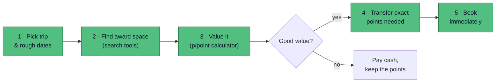

# Reward Flights — make the most of Amex UK points

The same points can be worth **£450 or £2,700**. This guide is about reliably landing on
the £2,700 side, with the least hassle, for Holdaisy.

## One example — the whole idea

Holdaisy wants **London → New York**. The same Avios points buy wildly different value
depending on the cabin:

| Booking | Cash price | Points + fees | Value per point |
| --- | --- | --- | --- |
| **Business class** | £3,200 | 100,000 Avios + £500 | **2.70p** ✅ |
| Economy | £450 | 50,000 Avios + £200 | 0.50p ❌ |

**The takeaway:** points are worth most where cash prices are highest — premium-cabin
long-haul. Spending them on a cheap economy hop wastes them. That one idea drives everything
else in this guide. (Run your own numbers in the [calculator](/expected-value).)

## How a good booking actually happens

:::warning Find the seat *before* you transfer points
Transfers are almost always **irreversible**. Confirm a bookable seat exists first — then
transfer only what that booking needs.
:::

## Start here

1. **[Finding award seats](/finding-flights)** — which search tool covers which airline.
2. **[Expected value & the calculator](/expected-value)** — the one number that says book-or-not.
3. **[When to book](/when-to-book)** — the two windows, and the dead zone.
4. **[Airline transfer partners](/transfer-partners)** — what you can convert points into.
5. **[Best-value airlines](/best-value-airlines)** — where a point goes furthest.
6. **[Destinations by airline](/destinations)** — sweet-spot routes, on an interactive map.

## Glossary

- **Amex** — American Express; **MR** — Membership Rewards, Amex's transferable points currency.
- **EV** — Expected Value, here measured as **pence per point** (p/point).
- **Avios** — the shared points currency of British Airways, Iberia, Qatar and Aer Lingus.
- **Award space / award seat** — a seat an airline has released to be booked with points, not cash.
- **Redemption** — spending points/miles on a flight.
- **Surcharges (taxes & fees)** — the cash you still pay on a reward booking on top of the points.
- **Sweet spot** — a route/cabin where points buy unusually good value.
- **Cabin** — class of travel: economy, premium economy, business, first.

:::tip Figures change constantly
Ratios, fees and award charts move often. Treat everything here as a starting point and
**confirm on the Amex and airline sites before you transfer.**
:::
