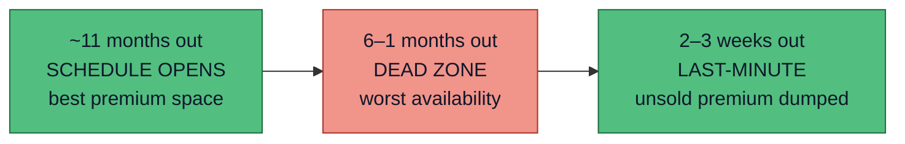

# When to book

There are only **two good windows** to book a reward flight, and a long dead zone between
them. This is what the booking year looks like:

:::tip 30-second version
Book either **~11 months ahead** (the day the airline's schedule opens) **or 2–3 weeks out**
(when unsold premium seats are released). Avoid the **1–6 month dead zone**. And always
**find the seat before you transfer points** — never the reverse.
:::

## The two windows

- **Schedule opens (~330–355 days out).** Premium-cabin long-haul — where the best value (EV,
  Expected Value, in pence per point) lives — has the most space the day it opens. For two seats
  together, this is your best shot. Set a reminder ~11 months before travel.
- **Last-minute (≈2–3 weeks out).** Airlines dump unsold premium seats back into award space.
  Great if your dates are flexible; useless if you need fixed dates months ahead.

## The golden rule of transferring

:::danger Find the seat first. Transfer second. Never the reverse.
Once Membership Rewards (MR) points become airline miles, **you cannot convert them back**. A
mistimed transfer to a slow partner can leave you with stranded miles and no seat.
:::

- **Instant partners** (British Airways, Virgin Atlantic) let you confirm the seat, *then*
  transfer — near-zero risk.
- **Slow partners** (Singapore up to 15 working days, SAS 5 days) force a gamble: you transfer
  hoping the seat survives the wait. Only for redemptions you're certain about. See transfer
  speeds in the [partners table](/transfer-partners).

## Devaluation: why points beat miles until you book

Airlines can cut what their miles are worth at any time, often without notice. Two defences:

1. **Keep value as MR points, not airline miles, until you book** — Amex points can't be
   devalued by one airline.
2. **Don't over-transfer** — move only what the booking needs. Leftover miles are exposed to the
   next devaluation and often expire.

## Worth waiting for

| Event | What it gives you |
| --- | --- |
| **Amex transfer bonus** (occasional) | +20–30% miles on transfer to a partner — a real value boost. Wait for one if you can. |
| **Flying Blue Promo Rewards** (monthly) | 25–50% off specific Air France/KLM routes. |
| **Airline flash sales** (a few times a year) | Discounted award charts on Virgin, Qantas and others. |

## The cadence for Holdaisy

1. Decide the trip and rough dates.
2. Search award space → [Finding award seats](/finding-flights).
3. Only when a good seat shows, check the [calculator](/expected-value).
4. Transfer the exact points needed.
5. Book immediately — award seats vanish fast.
